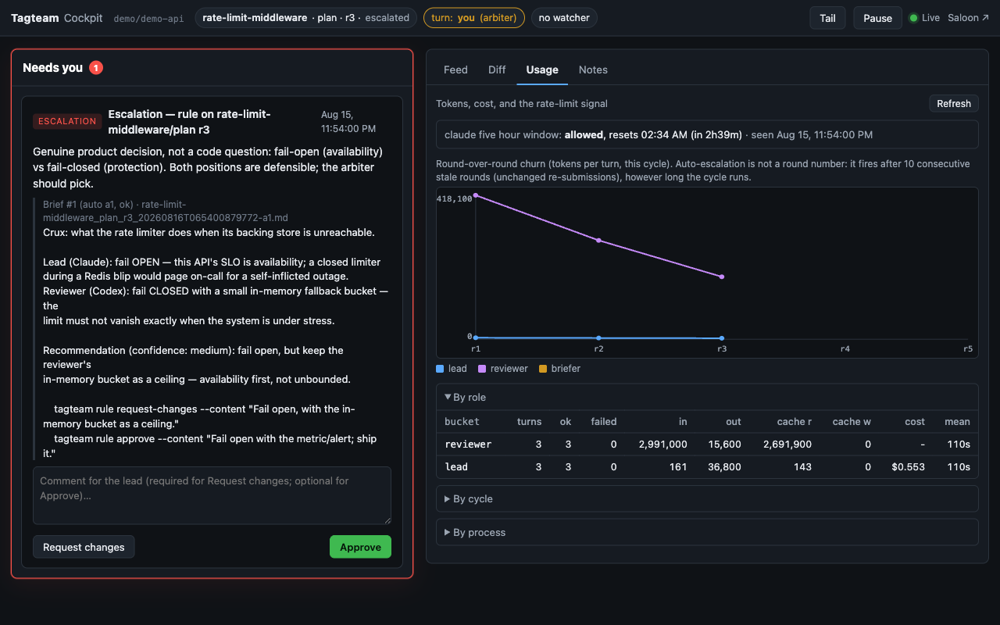

# How tagteam works

The long version of the [README](../README.md), section by section, in the
same order. Each heading below is the anchor the README links to.

- [The loop](#loop) · [One cycle](#cycle) · [Modes](#modes) · [Headless](#headless) · [Arbiter controls](#controls) · [Escalations and the briefer](#escalations) · [The cockpit](#cockpit) · [The hub](#hub) · [The Saloon](#saloon) · [Files tagteam writes](#files)

<a id="loop"></a>
## The loop

Work progresses phase by phase. Each phase is listed in `docs/roadmap.md` and goes through two cycles: **plan**, then **impl** (implementation). The lead opens a cycle by submitting; the reviewer responds with `APPROVE`, `REQUEST_CHANGES`, `ESCALATE` (a disagreement only the human can settle) or `NEED_HUMAN` (a question only the human can answer). Approval closes the cycle; a plan approval means "implement it, then open the impl cycle"; an impl approval means "phase complete, next phase".

State is tracked in `handoff-state.json` (current turn) and `docs/handoffs/<phase>_<type>_rounds.jsonl` + `_status.json` (per-cycle rounds). Either agent can pick up where the other left off at any time. Every cycle/state write resolves the project root by walking up from the current directory to the nearest `tagteam.yaml` before falling back to `git rev-parse` — so a nested git repository never shadows the outer tagteam project.

The agents follow one contract, `.claude/skills/handoff/SKILL.md` (installed by `tagteam setup`): the status banner, the action commands, the NEXT box, and the rules for amendments and headless turns. `/handoff` reads the role from `tagteam.yaml` and the state from `handoff-state.json` and does the right thing for whoever runs it.

<a id="cycle"></a>
## One cycle

A **round** is one lead `SUBMIT_FOR_REVIEW` plus the reviewer's response. `AMEND` lets the lead attach new information to the active round without bumping the round number or returning the turn (for example, when the arbiter answers an open question mid-review). The reviewer's `REQUEST_CHANGES` hands the turn back; the lead re-submits as round N+1.

**Auto-escalation.** Every `REQUEST_CHANGES` checks how many *consecutive* lead submissions were byte-identical to the one before (the first submission is the baseline and is never itself stale). At **10 consecutive stale rounds** the cycle escalates to the arbiter automatically. A cycle that keeps changing — even slowly — never trips this; a long, progressing cycle can go well beyond ten rounds.

**Escalated / needs-human** cycles wait for the arbiter's ruling (below). A ruling `approve` closes the cycle from the reviewer's seat; `request-changes` hands the turn back to the lead without re-arming auto-escalation; `answer` (for `NEED_HUMAN`) delivers the answer as an interjection and re-arms the cycle for the role that asked.

<a id="modes"></a>
## Modes: manual, watched, headless

Every mode runs the same loop over the same files; only the automation differs.

- **Manual** — no watcher. You paste each agent's `/handoff` output into the other agent yourself. Zero setup beyond `tagteam setup`.
- **Watched** — `tagteam watch --mode notify|iterm2|tmux` polls `handoff-state.json` and, on a turn flip, either notifies you (`notify`) or types the next command into the right terminal (`iterm2` / `tmux`), detecting a busy terminal first so it never interrupts in-flight work. `--confirm` pauses for your approval before each automatic send. `tagteam quickstart` / `tagteam session start` create the terminals (three tabs or panes: Lead, Watcher, Reviewer) and auto-launch the agents; `default_backend()` picks iTerm2 on macOS, tmux where available, and `manual` (print the commands) elsewhere.
- **Headless** — the watcher spawns each turn as a fresh CLI process. Below.

<a id="headless"></a>
## Headless mode (opt-in)

Instead of typing commands into long-lived agent terminals, the watcher can spawn each turn as a **fresh process** through the agent's own signed-in CLI (`claude -p` for Claude, `codex exec` for Codex — subscription auth, no API keys):

```bash
tagteam watch --mode headless          # never auto-detected; explicit opt-in only
tagteam tail                           # follow the in-flight turn like CI logs
```

On every turn flip the orchestrator composes a bounded context (the handoff skill contract + `handoff-state.json` + the last 3 rounds), pipes it to the agent on stdin, streams the agent's structured output to `.tagteam/turns/<phase>_<type>_r<N>_<role>_<ts>.log` (human-readable) and `.events.jsonl` (raw), and — because the agent still writes its own round with `tagteam cycle add` — verifies that the expected round landed before dispatching the other agent. Per-turn token usage is recorded in the project DB (`usage` table) for later phases to surface.

**When something goes wrong** (turn timeout — 60 min by default; nonzero exit; the agent exited without writing its round; or the CLI could not be started at all), the watcher pauses dispatch, writes `.tagteam/headless-paused.json` with the reason and log path, and sends a notification. It never retries silently. To resume: read the log, fix anything needed, delete the marker; the watcher picks up on its next tick.

```bash
tagteam watch --mode headless --turn-timeout 90 --tail-rounds 5 --confirm
tagteam cycle rounds --phase my-phase --type plan --tail 2   # last 2 entries only
```

Per-role options live under `agents.<role>.headless` in `tagteam.yaml` (all optional):

```yaml
agents:
  lead:
    name: Claude
    headless:
      provider: claude                # claude | codex (inferred from command/name if omitted)
      executable: /opt/bin/claude     # default: `claude` on PATH
      args: ["--model", "opus"]       # a YAML list; validated — no positionals, no reserved flags
  reviewer:
    name: Codex
    headless:
      args: ["-c", "approval_policy=untrusted"]
```

Defaults are the least-privileged unattended settings that still let the agent edit the repo and run the cycle CLI: Claude runs with `--permission-mode acceptEdits --allowedTools Bash Read Edit Write Glob Grep`; Codex with `--sandbox workspace-write -c approval_policy=never`. Anything you put in `args` is checked against a per-provider option table so a stray token can never become the prompt or override tagteam's own flags.

Interactive modes are unchanged — headless is a peer mode. It is also the path for **Windows**: it needs only `subprocess`, and the test suite runs on `windows-latest` in CI (a real signed-in CLI smoke on Windows is best-effort; see the Phase 31 findings doc).

<a id="controls"></a>
## Arbiter controls (any watcher mode)

```bash
tagteam pause --reason "reviewing by hand"    # every watcher mode holds dispatch
tagteam resume                                # clears the hold; the owed turn is re-dispatched once
tagteam cancel-turn                           # kill the in-flight headless turn → outcome 'cancelled', then paused
tagteam interject "prefer the smaller diff"   # note for the next turn (--to lead|reviewer to target a role)
tagteam interject --list                      # pending / delivered / retired notes for this cycle
tagteam interject --retire 3                  # close a note without delivering it
tagteam usage [--json]                        # per-turn tokens; roll-ups by role, by cycle, totals
```

- **pause/resume** use the same marker file the engine writes on a failed turn (`.tagteam/headless-paused.json`), so `resume` also tells you what failed and where the log is.
- **cancel-turn** never signals a PID it cannot bind to the recorded turn: it checks the child's and the watcher's creation identities (recorded at spawn) and the parent pid, and if anything is stale or unverifiable it just removes the stale metadata and says so.
- **interject** notes are stored with provenance (who, when, which cycle/round/turn was owed) in the project DB and go into the *next eligible* turn's prompt under an `ARBITER INTERJECTIONS` heading (headless) or show up as `interjections` on `tagteam cycle rounds` (interactive). A note is scoped to the cycle it was written for; delivery is stamped only when the receiving turn succeeds. `--to reviewer` waits for the reviewer's turn.
- **Retries** (`tagteam watch --mode headless --turn-retries N`, default 0) re-run a failed turn only when it provably did nothing: the outcome is `spawn_failed`/`nonzero_exit`/`timeout` **and** a content-sensitive repo fingerprint (HEAD + index + worktree, recursively through every gitlink) **and** the handoff state are unchanged. `no_round`/`cancelled` are never retried; any git failure or unmerged index fails closed. Only `.gitignore`d paths are outside the fingerprint.
- Per-role turn timeouts: `agents.<role>.headless.timeout_minutes`.
- **Notifications** work on macOS (osascript), Windows (toast, `msg` fallback) and Linux (`notify-send`); `TAGTEAM_NO_NOTIFY=1` silences them.
- `tagteam rollback X.Y.Z` prints the revert recipe for your install (uv tool or pip, then `tagteam upgrade`) and runs it only with `--yes`.

<a id="escalations"></a>
## Escalations: the briefer and `tagteam rule`

When a cycle escalates (`ESCALATE`, `NEED_HUMAN`, or auto-escalation after 10 consecutive stale rounds) you are the arbiter. Opt in to the **escalation briefer** and the watcher will spawn one headless turn that writes you a decision brief — each side's position, the actual crux, what it checked, a recommendation with confidence, and the exact ruling commands:

```yaml
# tagteam.yaml
briefer:
  enabled: true              # opt-in; absent = off (0.9.0 behavior)
  # provider: claude          # default: the lead's provider
  # args: ["--model", "..."]  # try a lighter model; usage is recorded under role "briefer"
  # timeout_minutes: 15
```

```bash
tagteam brief                       # the brief for the CURRENT escalation event (never an older one)
tagteam brief --list                # every attempt (auto/manual, status, path)
tagteam brief --generate            # run the briefer now (manual attempt; also the retry path)
tagteam rule approve --content "…"  # arbiter takes the reviewer's seat: closes the cycle
tagteam rule request-changes --content "…"   # hands the turn back to the lead (no auto re-escalation)
tagteam rule answer --to reviewer --content "…"  # for NEED_HUMAN: answer delivered as an interjection, cycle re-armed
```

Briefs land in `docs/escalations/<phase>_<type>_r<N>_<event>-a<attempt>.md` (unique per escalation event and attempt; `…_latest.md` is an alias) and in the project DB. It fires **at most once automatically per escalation event** (a pre-spawn claim guarantees this even with two watchers), never retries on its own, never pauses the loop, and its tokens show up in `tagteam usage`. Everything it does is read-only except writing the brief file.

<a id="cockpit"></a>
## The Cockpit

A browser dashboard built around the arbiter's actual job — *does anything need me?* then *is it healthy and what is it doing?* — over the data the headless engine, controls and briefer record:

```bash
tagteam serve --theme cockpit --dir ~/projects/myproject      # http://localhost:8080
```

- **Now** strip — phase / type / round, whose turn and for how long, the in-flight headless turn (with a `tagteam tail` drawer), the pause hold, watcher liveness, queued notes, and the connection mode (**Live** via SSE / **Polling** fallback / Disconnected).
- **Needs you** — one card per thing only the human can do: an escalation with its brief and **Approve / Request changes**, a needs-human question with **Answer**, a hold with **Resume**, a missing/failed brief with **Generate brief**, a stale in-flight or missing watcher with the CLI to run. Empty when nothing needs you — and it says so.
- **Watch** tabs — **Feed** (live round stream: entries, rulings, interjections, briefs), **Diff** (scope-diff of the current submission, per file, capped), **Usage** (round-over-round churn with the auto-escalation limit marked, burn by role / cycle / process, and the Claude subscription-window signal), **Notes** (interjections: queue one, retire one).

<p align="center"></p>

The Now strip's watcher chip is project-bound: with `serve.theme: cockpit` in `tagteam.yaml` (or `tagteam watch --pidfile`) the watcher keeps an identity-checked `.tagteam/watcher.json` for its lifetime; otherwise the cockpit finds the watcher by process scan (cwd = the project) and the in-flight turn's runner identity. A bare `tagteam watch` writes nothing new.

Every button is the CLI command with the same effect (`tagteam pause`, `resume`, `interject`, `cancel-turn`, `brief --generate`, `rule …`) — final actions confirm by showing the exact CLI line the server will run, and every action reports the CLI's own message. Recorded as `by = web:<user>`. Set `serve: {theme: cockpit}` in `tagteam.yaml` to make it the default for a project.

**Security note.** Cockpit mode binds **127.0.0.1** by default; a per-run token is embedded in the page and required as `X-Tagteam-Token` on every POST (`Origin`/`Referer` must match the server; no `*` CORS). That stops cross-site POSTs and non-browser clients that have not read the page — it is not remote-access authentication. `--host 0.0.0.0` deliberately exposes the server on the network; the page token is then the only guard, so do that only on a network you trust.

<a id="hub"></a>
## The Hub (all your projects)

```bash
tagteam hub                     # http://localhost:8090 — every registered project, ranked by what needs you
tagteam hub --list [--json]     # the same triage as text
```

One surface over every project `tagteam setup` registered (`~/.tagteam/projects.json`), ranked by intent: **Needs you** (escalations, questions, paused-after-failure — one **Open** per row), **Waiting** (turns owed to agents, oldest first; **stale** when nothing is dispatching, **abandoned?** past a day — with the CLI to run), **Quiet** (done / idle, collapsed to a count). The strip shows how many are live, burn across projects (24 h / 7 d) and the shared subscription window (newest signal per provider/kind across *every* registered project — the subscription is one pool, so hidden projects count too; burn totals are for the visible projects only). **Open** takes you into that project's cockpit, mounted by the hub at `/p/<id>/` — same token, same loopback default — so ruling, pausing or interjecting anywhere is two clicks away.

The hub is read-only: it never migrates a project database (`mode=ro`), never rewrites the registry (`tagteam registry list` / `tagteam registry unregister PATH` are the only registry commands, and only `unregister` writes). Missing dirs, scratch paths and dirs without `tagteam.yaml` are hidden by default (`--all` / "show hidden"). `tagteam hub --registry PATH` reads a different registry file the same way (used by the screenshot seed in `docs/media/`).

<a id="saloon"></a>
## The Saloon (theme)

The original western-themed dashboard survives as a theme — bare `tagteam serve` (no `--theme`, no config key) is unchanged from 0.10.0: the Saloon at `/`, all interfaces, no token, no cockpit endpoints. In cockpit mode it lives at `/?theme=saloon` (and works there, token included). Under a hub mount only the cockpit is served.

```bash
tagteam serve --dir ~/projects/myproject           # legacy Saloon (0.10.0-identical)
```

`tagteam tui` is an optional Textual terminal UI over the same state (`pip install 'tagteam[tui]'`).

<a id="files"></a>
## Files tagteam writes (and where)

| path | who writes it | what it is |
|---|---|---|
| `tagteam.yaml` | `tagteam init` (you edit it) | agents, headless options, `briefer`, `serve.theme` |
| `handoff-state.json` | `tagteam cycle …`, `tagteam rule …`, the watcher | whose turn, which phase/type/round, status, history |
| `handoff-diagnostics.jsonl` | state/cycle writers | diagnostics when a write is skipped or out of sequence |
| `docs/handoffs/<phase>_<type>_rounds.jsonl` / `_status.json` | `tagteam cycle init` / `add`, rulings | the canonical per-cycle round log and its status (append-only rounds) |
| `docs/handoffs/<phase>_<type>.md` | auto-export (`TAGTEAM_STEP_B=1`) | a rendered read-only view of the cycle |
| `.tagteam/tagteam.db` | every writer (shadow) | SQLite mirror of state/rounds plus usage, interjections, briefs, rate limits |
| `.tagteam/turns/<phase>_<type>_r<N>_<role>_<ts>.log` / `.events.jsonl` | headless watcher | one headless turn's human-readable log and raw event stream |
| `.tagteam/headless-paused.json` | headless watcher, `tagteam pause` | the hold marker (reason, log path); delete or `tagteam resume` to continue |
| `.tagteam/watcher.json` | `tagteam watch --pidfile` / `serve.theme: cockpit` | identity-checked watcher pidfile for the cockpit's liveness chip |
| `.tagteam/legacy/` | `tagteam migrate --to-step-b` | cycle files moved out of `docs/handoffs/` on Step B activation; still read by the CLI, cockpit and hub |
| `docs/escalations/<phase>_<type>_r<N>_<event>-a<attempt>.md` (+ `_latest.md`) | the briefer | decision briefs, one per escalation event and attempt |
| `docs/roadmap.md`, `docs/decision_log.md`, `docs/checklists/`, `templates/`, `.claude/skills/handoff/SKILL.md` | `tagteam setup` / `tagteam upgrade` | the framework files (created once; skill/templates/checklists refreshed on upgrade) |
| `~/.tagteam/projects.json` | `tagteam setup` (register), `tagteam upgrade` (prune), `tagteam registry unregister` | the registry of set-up projects the hub and `upgrade` read |
