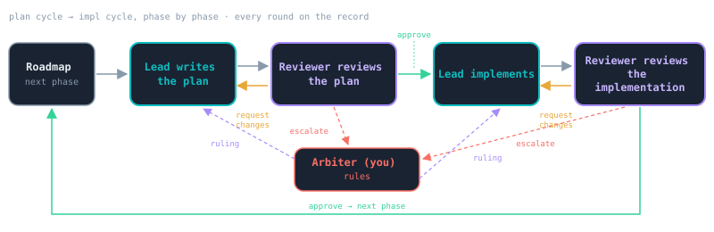
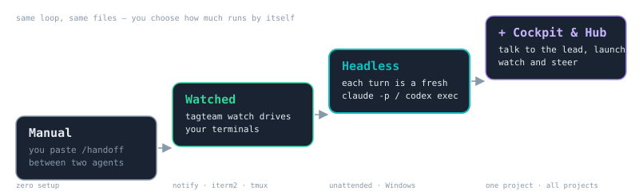

# Tagteam, for an outside reader

*Two AIs hand off the work, one human breaks the tie.* Tagteam is a small
Python CLI that runs a **Lead** agent and a **Reviewer** agent through a
roadmap, phase by phase, with a human **Arbiter** who is called only when
the two cannot settle something. This page is the short version, with the
numbers from tagteam's own development — tagteam is built with tagteam.

## The problem

An AI grading its own work rarely catches its own blind spots; a second
model with different training does. Long agent sessions drift and get
expensive; short, bounded turns don't. And a human who has to relay every
message between two agents is the bottleneck — the loop should run by
itself and call you only when it needs a decision.

## The loop

Every phase goes through two cycles — **plan**, then **impl** — and every
cycle is a sequence of rounds: the Lead submits, the Reviewer approves,
requests changes, or escalates. Each round is appended to a JSONL log in
the repository, so the whole history is on the record and either agent can
pick up where the other left off. Auto-escalation is not a round cap: it
fires only after **10 consecutive stale rounds** (the Lead re-submitting
unchanged content), so a cycle that keeps making progress can run as long
as it needs.

You choose how much runs by itself — paste `/handoff` between two terminals
yourself, let `tagteam watch` drive the terminals, or go **headless**, where
each turn is a fresh `claude -p` / `codex exec` process with a bounded
context and its token usage recorded. A browser **cockpit** (one project)
and a **hub** (every project you have set up) show what needs you, start
the next step, let you talk to the lead, and let you rule, pause or
interject with the same CLI commands.

## What one phase looks like

An abridged real cycle from this repository — the plan cycle for the
cross-project hub (Phase 35), two rounds to approval, from
`docs/handoffs/cross-project-hub-30-arc_plan_rounds.jsonl`:

> **r1 · lead · SUBMIT_FOR_REVIEW** — Phase 35 plan submitted … Designed
> flow-first with the ux-design-guide skill … user goal "across all my
> projects — what needs me, is anything stuck, how much am I burning" …
> Grounded in the REAL registry on this machine: 43 dirs, 21 with a
> handoff state, a long quiet tail, two turns owed for days/weeks
> unnoticed …
>
> **r1 · reviewer · REQUEST_CHANGES** — The hub direction and UX hierarchy
> are strong, but the plan needs the following contract-level revisions
> before implementation: 1. Replace the proposed "cached handler instances
> + path rewriting" mount design with a viable request-dispatch
> architecture … those instances cannot safely be cached or delegated to
> … Specify the reusable seam …
>
> **r2 · lead · SUBMIT_FOR_REVIEW** — Round 2: all four contract points
> folded into the plan … The cockpit routing is factored out of
> `make_handler` into a `CockpitRouter` … immutable per-project context
> only … `make_handler` builds one router and delegates (standalone
> unchanged, existing tests unmodified) …
>
> **r2 · reviewer · APPROVE** — Approved. Round 2 resolves the requested
> architecture, registry, read-only/live-refresh, rate-limit aggregation,
> and abandonment contracts with specific isolation and regression tests.
> The plan is feasible and ready for implementation.

The full text of every round of every cycle is in `docs/handoffs/` (and
`.tagteam/legacy/` for the oldest ones).

## The numbers

Generated from this repository's tracked cycle files by
`scripts/showcase_numbers.py` and byte-compared by the test suite, so the
table cannot go stale silently. As-of is an inclusive UTC day; the usage
table comes from a sanitized snapshot (`docs/showcase-data/`) of `tagteam
usage --json` with the same cutoff.

<!-- python scripts/showcase_numbers.py report --as-of 2026-08-15 --usage docs/showcase-data/usage-2026-08-15.json -->
<!-- showcase-numbers:begin as-of=2026-08-15 -->
### Review cycles (as of 2026-08-15, UTC)

| | plan | impl | all |
|---|---|---|---|
| cycles | 13 | 13 | 26 |
| approved | 13 | 13 | 26 |
| approved by ruling | 0 | 0 | 0 |
| escalated | 0 | 0 | 0 |
| in progress | 0 | 0 | 0 |
| aborted | 0 | 0 | 0 |
| approved at round 1 | 1 | 5 | 6 |
| rounds to approval | median 3 · mean 3.00 · max 7 | median 2 · mean 2.00 · max 4 | median 2 · mean 2.50 · max 7 |
| rounds-to-approval distribution (rounds: cycles) | 1: 1, 2: 5, 3: 5, 6: 1, 7: 1 | 1: 5, 2: 4, 3: 3, 4: 1 | 1: 6, 2: 9, 3: 8, 4: 1, 6: 1, 7: 1 |
| longest stale streak in any cycle | 0 | 0 | 0 |

### Rounds

| entries | count |
|---|---|
| lead submissions (rounds) | 65 |
| reviewer: request changes | 39 |
| reviewer: approve | 26 |
| reviewer: escalate | 0 |
| reviewer: need human | 0 |
| lead amendments | 0 |
| arbiter rulings | 0 |
| pushback rate (request changes ÷ submissions) | 60% |
| auto-escalation limit | 10 consecutive stale rounds (never reached) |

### Headless turns (as of 2026-08-15, UTC)

| role · provider | turns | retries | mean duration | input tokens | output tokens | cache read | cache write | priced |
|---|---|---|---|---|---|---|---|---|
| reviewer · codex | 22 | 0 | 173 s | 14,407,645 | 110,154 | 13,045,504 | 0 | 0/22 |
| lead · claude | 1 | 0 | 211 s | 48 | 16,274 | 1,635,000 | 64,718 | 1/1 · $3.74 |

Attempts not counted above (by outcome): cancelled: 1.

Round-over-round input tokens per cycle (one provider per series; descriptive only):

| cycle | role · provider | r1 → rN |
|---|---|---|
| escalation-briefer-30-arc/impl | reviewer · codex | 1,665,420 → 1,432,192 → 895,052 → 582,515 |
| escalation-briefer-30-arc/plan | reviewer · codex | 471,457 → 524,184 → 288,894 → 234,732 → 372,820 |
| escalation-briefer-30-arc/plan | lead · claude | 48 |
| headless-turn-engine-30-arc/impl | reviewer · codex | 1,688,685 → 715,789 → 282,114 |
| orchestration-controls-usage-surfacing-30-arc/impl | reviewer · codex | 1,587,326 → 868,648 → 955,951 |
| orchestration-controls-usage-surfacing-30-arc/plan | reviewer · codex | 378,011 → 290,362 → 189,821 → 298,649 → 278,432 → 221,741 → 184,850 |

Method: cycles = one (phase, type) with a status file under `docs/handoffs/` or `.tagteam/legacy/` (`docs/handoffs/` wins); as-of is an inclusive UTC day (entries at or after the next 00:00Z dropped, cycles with no earlier entry excluded); outcome from the last surviving entry; a round is one lead submission; rounds to approval = the approving entry's round; amendments and arbiter rulings are their own rows; pushback = request-changes ÷ submissions; a stale streak counts consecutive unchanged re-submissions (the first submission is the baseline and is not stale) and auto-escalation fires at 10. Headless: only `ok` turns enter duration/token statistics, other outcomes are listed, the highest attempt per (cycle, round, role) is used and earlier ok attempts count as retries, null token fields are excluded and shown as unknown; token accounting differs by provider (Codex reports cache reads inside input tokens, Claude reports them separately), so series never mix providers and no cross-provider comparison is implied; cost only where the provider priced the turn.
<!-- showcase-numbers:end -->

Reading it: over the repository's own history, every cycle so far was
approved by the reviewer without an escalation, and the arbiter's
auto-escalation limit was never approached (longest stale streak: 0). Plan
cycles take longer than implementation cycles (median 3 vs 2 rounds), and
roughly six in ten submissions draw a change request before approval —
the reviewer is doing real work. In the headless turns recorded since the
engine landed, the reviewer's input tokens per round tend to fall as a
cycle converges (each series is one provider; the numbers are descriptive
and are not a cross-provider comparison).

## Where it is going

The 3.0 arc (`tagteam-3.0-proposal.md`) is complete with this release:
headless orchestration, arbiter controls, the escalation briefer, the
cockpit, the hub, and this visual story. Candidate later phases —
deterministic gatekeeper pre-checks, reviewer panels, roadmap-as-DAG, a
thin MCP server — are listed in the [roadmap](roadmap.md) and deliberately
unscheduled. Start with the [README](../README.md); the long version is
[How tagteam works](how-tagteam-works.md).
