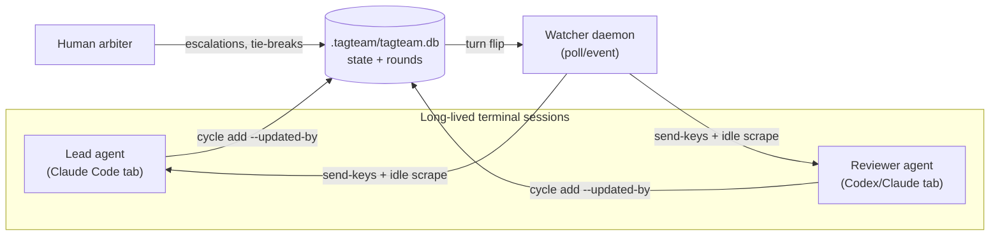
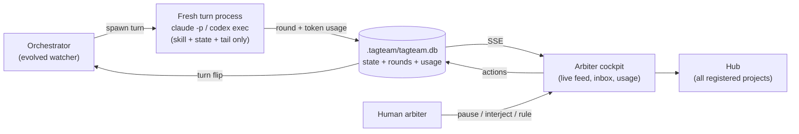
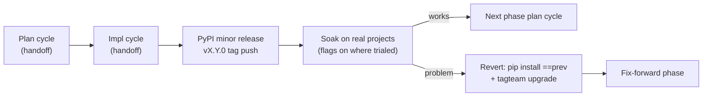

# Tagteam 3.0 — Proposal & Planning Document

This document is the brief for the 3.0 arc, in the same spirit as
`docs/tagteam-2.0-proposal.md`: the lead and reviewer should treat it as
an argument to be tested, not a finished spec. Each phase below gets its
own plan cycle; this document sets the shared frame so those cycles
don't re-litigate the fundamentals.

**One-line summary:** 2.0 made the existing loop cheaper and drift-proof
(SQLite store, tail reads, event watcher). 3.0 changes the *shape* of
the system: turns become spawned processes instead of keystrokes typed
into terminals, the human gets a real cockpit instead of a mascot scene,
and the whole thing becomes observable — including token usage — across
every project at once.

---

## 1. Where 3.0 came from

Brainstorm on 2026-08-14. Jack uses tagteam daily on every project. It
works. The remaining pain is not the loop itself but everything around
it:

- The watcher's terminal-poking (send-keys, screen-scrape idle
  detection) is the source of the remaining rare quirks: an agent
  occasionally sits idle on its turn, or a long-lived session drifts
  and "forgets" it's in a tagteam cycle.
- Arbitration means re-reading round logs by hand.
- Each project is an island; there is no single surface showing which
  of N projects needs Jack right now.
- Token consumption against subscription limits is invisible until a
  limit is hit.
- The dashboard (Saloon) optimizes for charm over information; it
  cannot drive the system.
- Windows users get the CLI but not the watcher (iTerm2/tmux
  dependency).

In the prompt → context → loop → graph engineering arc, tagteam is a
loop-engineering product whose 2.0 was context engineering inside the
loop. 3.0 is the deliberate graph step — but a *constrained* one. The
lead/reviewer/arbiter triangle with bounded rounds is the moat and is
not up for renegotiation. New agents wrap the loop (gatekeeper before
it, briefer after it); they do not join it as peers.

## 2. Hard constraints (every phase inherits these)

These are requirements, not preferences. A plan that violates one is
wrong even if it is otherwise better.

1. **Subscription-native.** Tagteam must keep running entirely on
   Jack's existing subscriptions. Headless invocation goes through the
   signed-in CLIs (`claude -p`, `codex exec`), which use subscription
   auth. No required API keys, no hosted services, no network
   dependency for the core loop. (This re-affirms the 2.0 proposal's
   rejection of SaaS memory/platform services.)
2. **Soak and revert.** Each phase ships as its own PyPI minor
   release, then soaks on real projects before the next phase begins.
   Revert must always be safe and easy. Mechanically:
   - New behavior ships behind opt-in flags or `tagteam.yaml` config;
     with flags off, the new release behaves identically to the
     previous one. "Flag-off behavior unchanged" is an acceptance
     criterion of every phase.
   - Schema/file-format changes are **additive only** during the 3.0
     arc (new tables, new nullable columns — never renames or
     removals), so the previous release can still read the state of a
     live project after a downgrade.
   - The revert recipe is two commands: `pip install tagteam==X.Y.Z`
     then `tagteam upgrade` in affected projects (framework files
     copied by `setup` don't revert with pip). Consider a
     `tagteam rollback X.Y.Z` convenience command in Phase 31.
   - For per-project trials, pipx side-by-side installs
     (`pipx install --suffix=@next tagteam==0.8.0`) let one project
     soak the new version while the rest stay on stable.
3. **Documentation as we go.** Every phase's acceptance includes
   updating the README (or a README-linked doc) so the public story
   always matches the shipped app. See §6.
4. **Windows is in scope by the end of the arc.** Not as a port of the
   terminal backends, but as a consequence of headless mode (§4,
   Phase 31–32).
5. **Token headroom is a budget.** Optional satellite agents must be
   deterministic-first, rare-firing, or opt-in, so they cannot
   silently eat subscription rate-limit headroom. Per-turn usage is
   recorded so this is verifiable, not aspirational.

## 3. Architecture: today vs. 3.0

### Today (interactive terminals + watcher)

Fragility lives on the `send-keys + idle scrape` edges: escape
sequences, prompt detection, busy heuristics — and the long-lived
sessions accumulate context all day (cost + drift).

### 3.0 (headless orchestration, opt-in mode)

Each turn is born fresh with a bounded context (skill contract, current
state, round-log tail). Consequences, in order of importance:

- **Reliability:** no idle detection, no send-keys. The quirk classes
  "agent sits idle on its turn" and "session drifts and jumps ahead"
  are eliminated in this mode by construction.
- **Windows:** pure `subprocess` spawning is cross-platform; the
  iTerm2/tmux dependency simply isn't on this path.
- **Tokens:** bounded per-turn context replaces an ever-growing
  transcript; finishes what 2.0's tail-reads started. Headless JSON
  output includes usage, giving per-turn accounting for free.
- **Extensibility:** a satellite agent is a prompt + an invocation,
  not another terminal pane.

**Interactive mode is not removed.** iTerm2/tmux backends remain for
driving-and-watching sessions; headless is a peer mode selected per
session. Visibility in headless mode comes from `tagteam tail`
(follow the current turn like CI logs) and, from Phase 34, the cockpit
live feed. Interaction moves to the boundaries: pause, cancel, and
**interject** — a note injected into the next turn's context, which
also lands in the auditable round history.

## 4. Phase breakdown

Phases are sequenced so each one de-risks or feeds the next. Each gets
its own plan cycle and its own PyPI release + soak. Estimated sizes are
relative to recent phases (29 = small, 28 = large).

### Phase 31 — Headless turn engine (large)

The keystone. Everything else leans on it.

- `tagteam watch --mode headless` (auto-detect never picks it during
  soak; explicit opt-in only).
- On turn flip, the orchestrator spawns the owed agent via its CLI
  (`claude -p`, `codex exec`) with a composed context: handoff skill
  contract, current state, round-log tail. Output is captured,
  streamed to a per-turn log, and written as the round.
- `tagteam cycle rounds --tail N` ships here (the orchestrator needs
  the tail query anyway; this closes the last open 2.0 follow-up).
- `tagteam tail` follows the in-flight turn live.
- Per-turn token usage captured from the CLI's structured output into
  a new additive `usage` table (recording only; surfacing is
  Phase 32/34).
- Failure handling: turn timeout, nonzero exit, malformed output →
  orchestrator marks the turn failed and pauses with a notification,
  never loops silently.
- **Windows acceptance criterion:** headless mode runs on Windows.
- Acceptance: flag-off behavior byte-identical to 0.7.x; a full
  plan+impl cycle completed headless on a real project.

### Phase 32 — Orchestration controls & usage surfacing (medium)

Makes headless mode livable day-to-day.

- `tagteam pause` / `tagteam resume` / `tagteam cancel-turn`.
- `tagteam interject "<note>"` — arbiter note injected into the next
  turn's context and recorded in the round log.
- `tagteam usage` — tokens by role / phase / cycle / project from the
  Phase 31 table; groundwork for cockpit panels.
- Windows notification path for notify mode (small library call).
- Optional: `tagteam rollback X.Y.Z` convenience (pip install + re-run
  `tagteam upgrade` in registered projects).

### Phase 33 — Escalation briefer (small)

First satellite agent; biggest arbiter-experience win per line of code.

- On `ESCALATE` / `NEED_HUMAN`, spawn one headless turn that writes a
  decision brief: both positions, what is actually in dispute, a
  recommendation. Stored with the escalation; shown by CLI and later
  the cockpit inbox.
- Fires only on escalation (rare by design) — respects the token
  budget constraint. Opt-out via config.

### Phase 34 — Arbiter cockpit (large)

Dashboard redesigned around the human's actual job: arbitration and
monitoring. The Saloon survives as an optional theme/skin, not as the
information architecture.

- Live round feed via SSE (replaces polling backoff).
- Open-threads / blockers panel (the structured columns already exist
  in the schema; nothing renders them today).
- Diff view of the current submission (scope-diff already computed).
- Escalation inbox: read the Phase 33 brief, rule
  (`APPROVE` / `REQUEST_CHANGES` with comment) from the browser.
- Token usage panels: burn by role, by phase (round-over-round churn
  curve flags stuck cycles before round-10 escalation does), by
  satellite process, plus a burn-down gauge against the current
  subscription window — the "which lever to pull" view (lighter model
  for a role, tighter caps, panel off).
- Tech: keep the hand-rolled server; SSE + better IA, no frontend
  framework.

### Phase 35 — Cross-project hub (medium)

- `tagteam hub` — one dashboard over every registered project
  (`registry.py` already knows them): whose turn is waiting, pending
  escalations, stale cycles, aggregate token burn against the shared
  subscription pool.
- For a daily-driver on N projects, this is the "what needs me"
  surface.

### Phase 36 — Visual story & portfolio feed (medium)

Dedicated storytelling phase; §6's per-phase docs duty keeps things
*accurate*, this phase makes them *compelling*.

- README restructured around a visual narrative: what tagteam is, the
  planning and review processes as flowcharts (mermaid renders on
  GitHub), the 3.0 architecture. Overflow to a README-linked
  `docs/how-tagteam-works.md`.
- Standalone SVG exports of the key diagrams (loop, plan/impl cycle
  state machine, headless architecture, cockpit screenshot set) in a
  `docs/media/` directory — deliberately shaped like the portfolio
  site's Aegis assets (`aegis-flow.svg`, `aegis-tiers.svg`) so a
  future `tagteam.html` portfolio page can consume them directly.
- A `docs/showcase.md` one-pager written for an outside reader: the
  problem, the loop, the numbers (rounds-to-approval, token curves
  from real soak data). This document drives the portfolio update;
  the portfolio repo itself is out of scope for this arc.

### Candidate later phases (explicitly unscheduled)

Kept out of the arc to protect focus; each can be promoted later.

- **Gatekeeper pre-checks** — deterministic-first (run tests +
  scope-diff before the reviewer sees a submission); model involvement
  only as a cheap opt-in.
- **Reviewer panels** — 2–3 lenses merged into one `REQUEST_CHANGES`;
  opt-in per phase (multiplies token cost).
- **Roadmap as DAG** — `depends_on` between phases; parallel phases in
  worktrees; cockpit renders the graph.
- **Thin MCP server** — justified now that a non-Claude agent (Codex)
  already participates via the scratch.md shuttle; still deferred
  until the headless path proves insufficient.
- **Terminal.app backend** — pre-existing backlog item; headless mode
  reduces its urgency.

### Explicit non-goals (unchanged from 2.0 analysis)

- Generic N-agent swarm topology — kills the legibility that makes the
  loop trustworthy.
- Memory services (Mem0/Letta/Zep) — wrong scale.
- Heavy frontend framework rewrite.
- Editing the portfolio repo — tagteam only produces the materials.

## 5. Release & soak protocol

- Soak length is Jack's call per phase; no next-phase plan cycle
  starts until he green-lights.
- Soak has a measuring stick: compare tokens-per-cycle and
  rounds-to-approval before/after each phase using the Phase 31 usage
  table — each phase should demonstrably pay for itself.
- Version note: 3.0 is an arc name. Releases proceed 0.8.0 → 0.9.0 →
  …; the release that completes Phase 36 ships as 3.0.0 (skipping
  1.x/2.x to match the project's own naming history).

## 6. Documentation as-we-go (standing acceptance criterion)

Every phase's impl cycle includes:

- README (or its linked doc) updated so it describes the app **as it
  now is** — including the new phase's feature and its flag.
- Diagrams updated when architecture changed (mermaid in-repo).
- CHANGELOG-style notes in the release commit.

Reviewer instruction: treat missing doc updates as `REQUEST_CHANGES`,
not a nit.

## 7. Known quirks ledger (not scheduled, tracked here)

Rare, recoverable, explicitly deprioritized by Jack — listed so they
inform design rather than getting lost:

1. A long-lived interactive agent occasionally forgets a tagteam
   session is in progress and jumps ahead with implementation.
   *(Session-drift class — eliminated by construction in headless
   mode; unaddressed in interactive mode.)*
2. An agent occasionally sits idle when the watcher shows it's clearly
   its turn. *(send-keys/idle-scrape class — same.)*

If either recurs in headless mode during soak, that's a Phase 31/32
bug, not a quirk.

## 8. Open questions for the plan cycles

1. **Phase 31:** exact context composition for a spawned turn — full
   skill contract every time, or a trimmed headless variant? Measure
   both against a real cycle.
2. **Phase 31:** `claude -p` and `codex exec` output formats differ;
   what's the abstraction (per-agent adapter table in config?) and how
   are new CLIs added?
3. **Phase 31:** does headless spawning interact with each CLI's
   session/resume features, and is resuming a prior headless session
   ever preferable to fresh-spawn (cache reuse vs. drift risk)?
4. **Phase 32:** what belongs in an interject's provenance record so
   the round log stays a faithful audit trail?
5. **Phase 33:** which model tier writes briefs — same as reviewer, or
   lighter? Cheap experiment during soak.
6. **Phase 34:** SSE vs. the existing polling for multi-client cases
   (cockpit open on two devices) — does the hand-rolled server need a
   small connection manager?
7. **Phase 35:** hub reads N project DBs directly (registry paths) —
   any locking concern with live watchers holding WAL connections?
8. **Versioning:** is `PRAGMA user_version` + `tagteam/migrations/`
   (Phase 28 open question, still unresolved) needed before the first
   additive schema change in Phase 31? Probably yes — settle it there.
